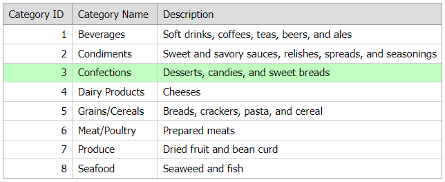

<!-- default badges list -->

[](https://supportcenter.devexpress.com/ticket/details/E1343)
[](https://docs.devexpress.com/GeneralInformation/403183)
<!-- default badges end -->
# Grid View for ASP.NET Web Forms - How to use both the RowClick and RowDoubleClick events.
<!-- run online -->
**[[Run Online]](https://codecentral.devexpress.com/e1343/)**
<!-- run online end -->

This example demonstrates how to handle the grid's client-side RowClick and RowDblClick events to perform custom operations on single and double row clicks.



## Overview

Follow the steps below:

1. Create the [Grid View](https://docs.devexpress.com/AspNet/DevExpress.Web.ASPxGridView) control, populate it with columns, and bind the control to a data source. Set the grid's [AllowFocusedRow](https://docs.devexpress.com/AspNet/DevExpress.Web.ASPxGridViewBehaviorSettings.AllowFocusedRow) property to `true` to enable row focus and use the [GridViewStyles.FocusedRow](https://docs.devexpress.com/AspNet/DevExpress.Web.GridViewStyles.FocusedRow) property to specify the appearance of the focused row.

    ```aspx
    <dx:ASPxGridView ID="ASPxGridView1" runat="server" AutoGenerateColumns="False" KeyFieldName="CategoryID"
        DataSourceID="AccessDataSource1">
        <Columns>
            <dx:GridViewDataTextColumn FieldName="CategoryID" ReadOnly="True" VisibleIndex="0">
                <EditFormSettings Visible="False" />
            </dx:GridViewDataTextColumn>
            <dx:GridViewDataTextColumn FieldName="CategoryName" VisibleIndex="1" />
            <dx:GridViewDataTextColumn FieldName="Description" VisibleIndex="2" />
        </Columns>
        <SettingsBehavior AllowFocusedRow="True" />
        <Styles>
            <FocusedRow BackColor="#C0FFC0" ForeColor="Black" />
        </Styles>
    </dx:ASPxGridView>
    <asp:AccessDataSource ID="AccessDataSource1" runat="server" DataFile="~/App_Data/nwind.mdb"
        SelectCommand="SELECT * FROM [Categories]">
    </asp:AccessDataSource>
    ```

2. Add a flag variable and create the `ProcessClick` function that the grid executes based on the flag variable value. Handle the grid's client-side [RowClick](https://docs.devexpress.com/AspNet/js-ASPxClientGridView.RowClick) and [RowDblClick](https://docs.devexpress.com/AspNet/js-ASPxClientGridView.RowDblClick) events. In the `RowClick` event handler, call the `setTimeout` method to set a timer for the `ProcessClick` function.

    ```js
    var doProcessClick;
    var index;
    function ProcessClick() {
        if (doProcessClick) {
            alert(`Here is the RowClick action in the ${index.toString()} row.`);
        }
    }
    function OnRowClick(s, e) {
        doProcessClick = true;
        index = e.visibleIndex + 1;
        window.setTimeout(ProcessClick, 500);
    }

    function OnRowDblClick(s, e) {
        doProcessClick = false;
        var key = s.GetRowKey(e.visibleIndex);
        alert(`Here is the RowDoubleClick action in the row with the key = ${key}.`);
    }
    ```

## Files to Review

* [Default.aspx](./CS/WebSite/Default.aspx) (VB: [Default.aspx](./VB/WebSite/Default.aspx))

## Documentation

* [RowClick](https://docs.devexpress.com/AspNet/js-ASPxClientGridView.RowClick)
* [RowDblClick](https://docs.devexpress.com/AspNet/js-ASPxClientGridView.RowDblClick)
